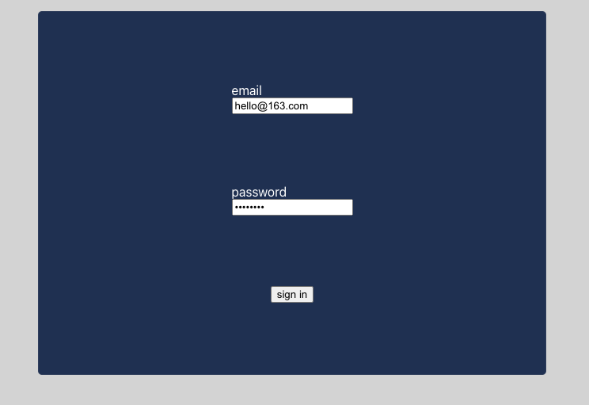
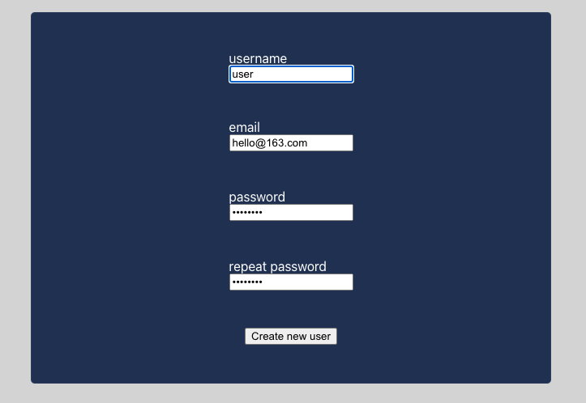

## Use Instructions

## login

In the login page you can choose to sign in to exist account (the account name is the email you set when you register):
 
or to use sign up function to register a new account by input the unique username and email:
.

## user profile
You can open your profile page by click the top-left button.
And in the profile page you can click the avatar to change another one:

Also you can change the username or email by click the specific area.
By click the Sign Out button to sign out.

## chat
You can click one of the users list in the sideBar area to start chat with this user:

